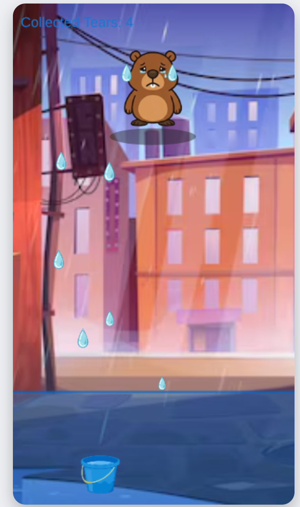
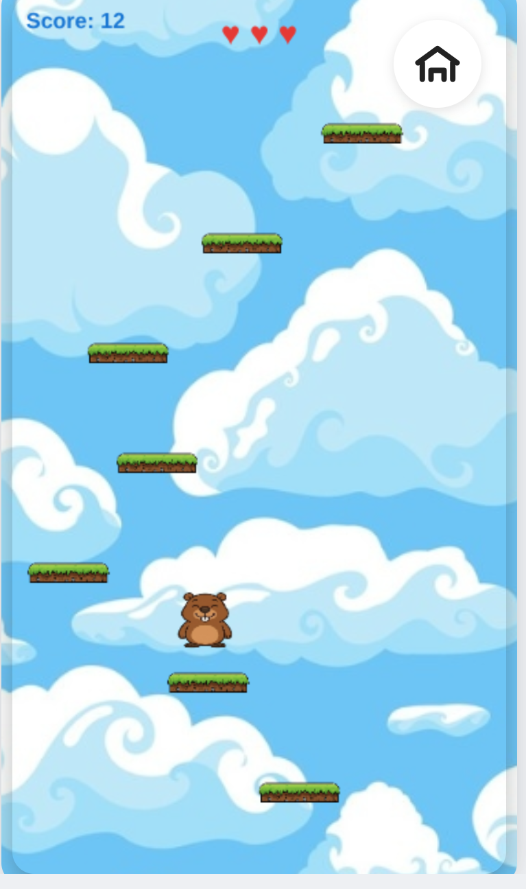
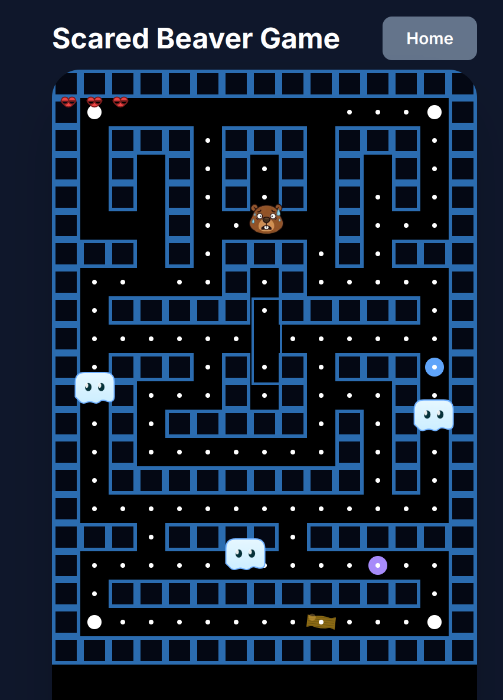
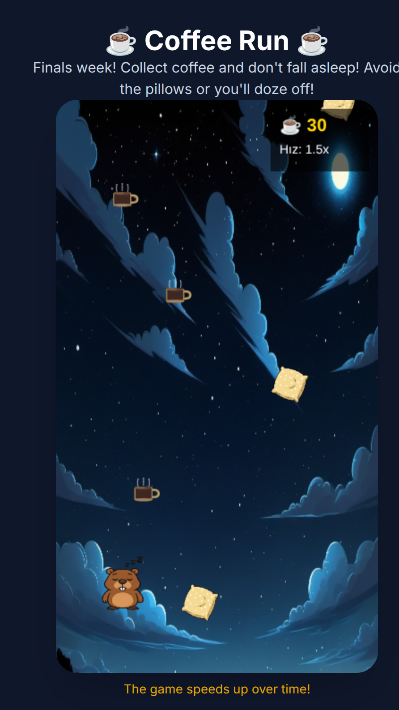
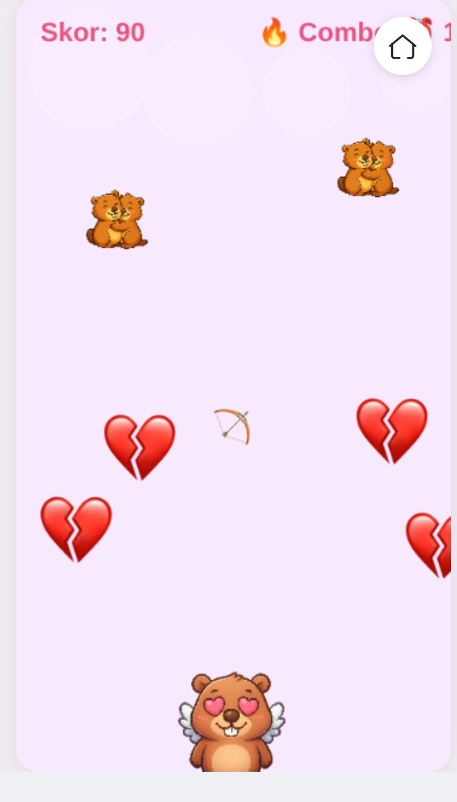
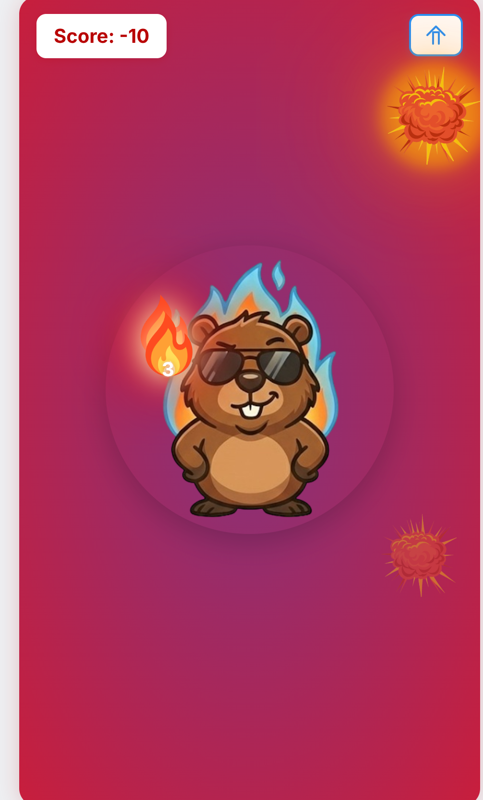

# Braver Beaver - Emotion-Based Mini Games

**Braver Beaver** is a collection of six emotion-themed mini-games built as a Mini App using [OnchainKit](https://onchainkit.xyz) and the [Farcaster SDK](https://docs.farcaster.xyz/). Play as Kunduz the Beaver and explore games based on different emotions and moods!

> [!IMPORTANT]
> This is a Mini App that can be published to the [Base App](https://www.base.dev) and Farcaster.

## Prerequisites

Before getting started, make sure you have:

*   A [Farcaster](https://farcaster.xyz/) account (for testing)
*   A [Vercel](https://vercel.com/) account for deployment
*   A [Coinbase Developer Platform](https://portal.cdp.coinbase.com/) Onchainkit Client API Key
*   Basic knowledge of [Base Build](https://www.base.dev) platform

## Getting Started

### 1. Fork & Clone & Install

* Fork this [repository](https://github.com/Trio-Blockchain-Labs/mini-app-quickstart-template.git)
* After forking, clone your forked template project
```bash
git clone https://github.com/[your_username]/[your_forked_repository_name].git
cd [your_forked_repository_name]
npm install
```

### 2. Configure Environment

Create a `.env` file based on `.example.env`:

```bash
NEXT_PUBLIC_ONCHAINKIT_API_KEY=<YOUR-CDP-API-KEY>
NEXT_PUBLIC_URL=http://localhost:3000
```

### 3. Run Locally

```bash
npm run dev
```

Open [http://localhost:3000](http://localhost:3000) to see your app.

## Customization

### Minikit Configuration

The `minikit.config.ts` file configures your app's manifest.

1.  Open `minikit.config.ts`.
2.  Update `name`, `subtitle`, and `description` to match your app idea.
3.  **Note:** Skip the `accountAssociation` for now; we will add this after deployment.
**IMPORTANT:** Follow [manifest](https://docs.base.org/mini-apps/core-concepts/manifest) documentation for configuring your app's manifest

**Note:** You can update manifest metadata of your app after **deployment** if you don't have an idea yet.

## Assets: Video & Mood Images (Braver Beaver)

To use the custom intro video and mood icons in the home screen, place files under the `public/` folder:

- Put your MP4 video at: `public/intro.mp4` (the homepage will autoplay this video as a background)
  
	If your file is named `background.mp4` (recommended), copy it with:

	```bash
	cp "~/Downloads/WhatsApp Video 2025-12-14 at 15.55.30.mp4" public/background.mp4
	```

	Or copy it as `intro.mp4` if you prefer the old name:

	```bash
	cp "~/Downloads/WhatsApp Video 2025-12-14 at 15.55.30.mp4" public/intro.mp4
	```
- Optional poster image for browsers that don't autoplay: `public/intro-poster.jpg`
- Mood images (optional). If you want the custom graphics to show on each mood button, place them as:
	- `public/moods/cry.png`
	- `public/moods/happy.png`
	- `public/moods/sweat.png`
	- `public/moods/sleep.png`
	- `public/moods/love.png`
	- `public/moods/fire.png`

If the mood images are not provided, the app will show emoji fallbacks on the buttons.

After adding the files, restart the dev server if needed:

```bash
npm run dev
```

### Slicing a single grid image into six mood icons (optional)

If you have a single image that contains all six stickers in a 3x2 grid (like the attachment you provided), you can split it automatically using the included Node script (requires `sharp`):

1. Put your source image into the repo (e.g. `public/moods-source.png`).
2. Install dependencies (if not already installed):

```bash
npm install
```

3. Run the slicing script:

```bash
npm run slice:moods public/moods-source.png
```

This will create `public/moods/cry.png`, `happy.png`, `sweat.png`, `sleep.png`, `love.png`, and `fire.png` in that left-to-right, top-to-bottom order. You can edit or re-run the script if the order doesn't match your image layout.


## Deployment

### 1. Deploy to Vercel

```bash
vercel --prod
```
**or** 

Use the [Vercel](https://vercel.com/) website and add your repository as a new project.

### 2. Update Production Env

In your Vercel project settings, add:

*   `NEXT_PUBLIC_ONCHAINKIT_API_KEY`
*   `NEXT_PUBLIC_URL` (Your [Vercel](https://vercel.com/) deployment URL)

## Base Build & Publishing

To publish your app to the Base App ecosystem:

1.  Go to [Base Build](https://www.base.dev) and log in.
2.  Click **Mini App Tools** button at top right of the website.
3.  Paste your deployed website link provided by Vercel into the field.
4.  Use the **Account Association** tools on Base Build to sign your manifest.
5.  Update `minikit.config.ts` with the signature and redeploy.

For detailed docs, visit [docs.base.org](https://docs.base.org/docs/mini-apps/quickstart/create-new-miniapp/).

---

## Disclaimer

This project is a **demo application** for educational purposes only.

## Braver Beaver Games

**Braver Beaver** is a collection of six emotion-themed mini-games featuring Kunduz the Beaver. Each game represents a different mood and offers unique gameplay mechanics.

### Game 1: Tears (Sad) - `/game-tears`
Catch falling tears with your bucket! Every tear that hits the ground creates a water puddle. If the puddles reach Kunduz, the game is over. Move left and right to catch as many tears as possible.

**Controls:** Tap left or right side of the screen to move the bucket.



### Game 2: Jump (Happy) - `/game-jump`
Jump on platforms and reach as high as you can! Kunduz has 3 lives. The game speeds up after reaching certain scores. If you fall and lose all lives, you burn and the game ends.

**Controls:** Swipe left or right to move Kunduz in that direction.



### Game 3: Scared - `/game`
Pac-Man style maze game! Kunduz runs away from ghosts and has 3 lives. Collect all the dots on the screen to increase your score. When all dots are collected, new ones appear and the game speeds up. If you lose all 3 lives, you burn and the game is over.

**Controls:** Use on-screen arrow buttons at the bottom to move up, down, left, or right.



### Game 4: Sleepy - `/game-sleepy`
Stay awake! Collect coffee cups to keep Kunduz energized while avoiding pillows that make him sleepy. Don't let the sleep meter fill up!

**Controls:** Tap left or right side of the screen to move.



### Game 5: Love - `/game-love`
Cupid Kunduz! Shoot arrows to hit lover beavers and bonuses while avoiding broken hearts. This is a timed game - when time runs out, the game ends. Aim carefully!

**Controls:** Drag and release to aim and shoot arrows in any direction.



### Game 6: Fire - `/game-fire`
Put out the fires! Each fire shows a number indicating how many times you need to tap it. If you don't extinguish a fire in time, it explodes. Your score starts at 0 - if it drops to -200, you lose. Reach 1000 points to win!

**Controls:** Tap on fires to extinguish them.



---

**Repository:** [github.com/zeynepsena316/mini-app-quickstart-template](https://github.com/zeynepsena316/mini-app-quickstart-template)

Play all six games and help Kunduz navigate through different emotions!
